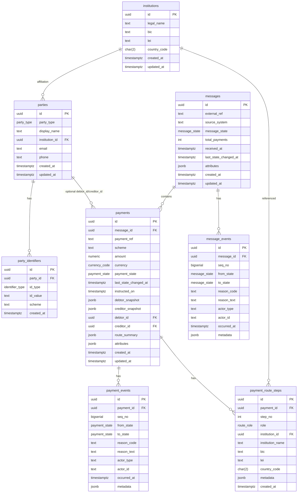

# Payment Processing Data Model — PostgreSQL (RDBMS)

> **Scope:** Message-based ingestion (Message → Payments) with a first-class **workflow/state machine**, immutable **audit logs**, and explicit **intermediary routing**. Production-grade DDL with types, constraints, and indexes.

## Design Overview

- **Normalization + Snapshots**
  - Canonical master data: `institutions`, `parties`, `party_identifiers`.
  - **Immutable payment-time snapshots** of debtor/creditor and route steps preserved in `payments` and `payment_route_steps` for audit fidelity even if master data changes.
- **Workflow & Audit**
  - Current aggregate state on `messages.message_state` and `payments.payment_state`.
  - **Append-only** transition logs: `message_events`, `payment_events` with `from_state`, `to_state`, actor, timestamps, metadata.
  - Optional guard tables: `valid_message_transitions`, `valid_payment_transitions`.
- **Intermediaries**
  - Ordered corridor via `payment_route_steps(step_no, role, institution_snapshot fields)`.
- **Safety & Ops**
  - `ON DELETE RESTRICT` on governed aggregates; cascades limited to ref-data tables.
  - Indexes for hot paths (state+time, FKs, business refs) and GIN on JSONB for ad-hoc filtering.
  - Ready for **partitioning** (e.g., monthly) on `payments` / `payment_events` at scale.

## Runnable DDL

```sql
-- Enable UUID generation
CREATE EXTENSION IF NOT EXISTS "uuid-ossp";

-- ===== ENUM TYPES =====
CREATE TYPE message_state AS ENUM (
  'RECEIVED','VALIDATED','ENRICHED','ROUTED','PARTIALLY_ACCEPTED',
  'ACCEPTED','SENT_TO_SCHEME','SETTLED','REJECTED','FAILED'
);

CREATE TYPE payment_state AS ENUM (
  'RECEIVED','VALIDATED','PENDING_FUNDS','ROUTED',
  'SENT_TO_SCHEME','SETTLED','REJECTED','FAILED'
);

CREATE TYPE party_type AS ENUM ('DEBTOR','CREDITOR','INTERMEDIARY','BOTH');
CREATE TYPE identifier_type AS ENUM ('IBAN','BBAN','ACCOUNT_NO','SORT_CODE','BIC','IFSC','LEI','OTHER');

CREATE TYPE currency_code AS ENUM (
  'AED','AUD','BRL','CAD','CHF','CNY','DKK','EUR','GBP','HKD','INR','JPY','KRW',
  'MXN','NOK','NZD','PLN','SEK','SGD','TRY','USD','ZAR'
);

CREATE TYPE route_role AS ENUM ('SENDER_BANK','CORRESPONDENT','INTERMEDIARY','RECEIVER_BANK');

-- ===== REFERENCE: INSTITUTIONS / PARTIES =====
CREATE TABLE institutions (
  id               UUID PRIMARY KEY DEFAULT uuid_generate_v4(),
  legal_name       TEXT NOT NULL,
  bic              TEXT,
  lei              TEXT,
  country_code     CHAR(2),
  created_at       TIMESTAMPTZ NOT NULL DEFAULT now(),
  updated_at       TIMESTAMPTZ NOT NULL DEFAULT now(),
  UNIQUE (bic),
  UNIQUE (lei)
);

CREATE TABLE parties (
  id               UUID PRIMARY KEY DEFAULT uuid_generate_v4(),
  party_type       party_type NOT NULL,
  display_name     TEXT NOT NULL,
  institution_id   UUID REFERENCES institutions(id) ON UPDATE CASCADE ON DELETE SET NULL,
  email            TEXT,
  phone            TEXT,
  created_at       TIMESTAMPTZ NOT NULL DEFAULT now(),
  updated_at       TIMESTAMPTZ NOT NULL DEFAULT now()
);

CREATE TABLE party_identifiers (
  id               UUID PRIMARY KEY DEFAULT uuid_generate_v4(),
  party_id         UUID NOT NULL REFERENCES parties(id) ON UPDATE CASCADE ON DELETE CASCADE,
  id_type          identifier_type NOT NULL,
  id_value         TEXT NOT NULL,
  scheme           TEXT,
  created_at       TIMESTAMPTZ NOT NULL DEFAULT now(),
  UNIQUE (party_id, id_type, id_value)
);

-- ===== MESSAGES =====
CREATE TABLE messages (
  id                     UUID PRIMARY KEY DEFAULT uuid_generate_v4(),
  external_ref           TEXT,
  source_system          TEXT NOT NULL,
  message_state          message_state NOT NULL DEFAULT 'RECEIVED',
  total_payments         INT NOT NULL DEFAULT 0,
  received_at            TIMESTAMPTZ NOT NULL DEFAULT now(),
  last_state_changed_at  TIMESTAMPTZ NOT NULL DEFAULT now(),
  attributes             JSONB NOT NULL DEFAULT '{}'::jsonb,
  created_at             TIMESTAMPTZ NOT NULL DEFAULT now(),
  updated_at             TIMESTAMPTZ NOT NULL DEFAULT now(),
  UNIQUE (external_ref)
);

CREATE TABLE message_events (
  id               UUID PRIMARY KEY DEFAULT uuid_generate_v4(),
  message_id       UUID NOT NULL REFERENCES messages(id) ON UPDATE CASCADE ON DELETE RESTRICT,
  seq_no           BIGSERIAL NOT NULL,
  from_state       message_state,
  to_state         message_state NOT NULL,
  reason_code      TEXT,
  reason_text      TEXT,
  actor_type       TEXT NOT NULL DEFAULT 'SYSTEM',
  actor_id         TEXT,
  occurred_at      TIMESTAMPTZ NOT NULL DEFAULT now(),
  metadata         JSONB NOT NULL DEFAULT '{}'::jsonb,
  UNIQUE (message_id, seq_no)
);

-- ===== PAYMENTS =====
CREATE TABLE payments (
  id                     UUID PRIMARY KEY DEFAULT uuid_generate_v4(),
  message_id             UUID NOT NULL REFERENCES messages(id) ON UPDATE CASCADE ON DELETE RESTRICT,
  payment_ref            TEXT,
  scheme                 TEXT NOT NULL,
  amount                 NUMERIC(19,4) NOT NULL,
  currency               currency_code NOT NULL,
  payment_state          payment_state NOT NULL DEFAULT 'RECEIVED',
  last_state_changed_at  TIMESTAMPTZ NOT NULL DEFAULT now(),
  instructed_on          TIMESTAMPTZ NOT NULL DEFAULT now(),
  debtor_snapshot        JSONB NOT NULL,
  creditor_snapshot      JSONB NOT NULL,
  debtor_id              UUID REFERENCES parties(id) ON UPDATE CASCADE ON DELETE SET NULL,
  creditor_id            UUID REFERENCES parties(id) ON UPDATE CASCADE ON DELETE SET NULL,
  route_summary          JSONB NOT NULL DEFAULT '{}'::jsonb,
  attributes             JSONB NOT NULL DEFAULT '{}'::jsonb,
  created_at             TIMESTAMPTZ NOT NULL DEFAULT now(),
  updated_at             TIMESTAMPTZ NOT NULL DEFAULT now(),
  UNIQUE (payment_ref)
);

CREATE TABLE payment_events (
  id               UUID PRIMARY KEY DEFAULT uuid_generate_v4(),
  payment_id       UUID NOT NULL REFERENCES payments(id) ON UPDATE CASCADE ON DELETE RESTRICT,
  seq_no           BIGSERIAL NOT NULL,
  from_state       payment_state,
  to_state         payment_state NOT NULL,
  reason_code      TEXT,
  reason_text      TEXT,
  actor_type       TEXT NOT NULL DEFAULT 'SYSTEM',
  actor_id         TEXT,
  occurred_at      TIMESTAMPTZ NOT NULL DEFAULT now(),
  metadata         JSONB NOT NULL DEFAULT '{}'::jsonb,
  UNIQUE (payment_id, seq_no)
);

CREATE TABLE payment_route_steps (
  id               UUID PRIMARY KEY DEFAULT uuid_generate_v4(),
  payment_id       UUID NOT NULL REFERENCES payments(id) ON UPDATE CASCADE ON DELETE CASCADE,
  step_no          INT NOT NULL,
  role             route_role NOT NULL,
  institution_id   UUID REFERENCES institutions(id) ON UPDATE CASCADE ON DELETE SET NULL,
  institution_name TEXT NOT NULL,
  bic              TEXT,
  lei              TEXT,
  country_code     CHAR(2),
  metadata         JSONB NOT NULL DEFAULT '{}'::jsonb,
  created_at       TIMESTAMPTZ NOT NULL DEFAULT now(),
  UNIQUE (payment_id, step_no)
);

-- Optional: whitelist of allowed transitions
CREATE TABLE valid_message_transitions (
  id               UUID PRIMARY KEY DEFAULT uuid_generate_v4(),
  from_state       message_state,
  to_state         message_state NOT NULL,
  UNIQUE (from_state, to_state)
);
CREATE TABLE valid_payment_transitions (
  id               UUID PRIMARY KEY DEFAULT uuid_generate_v4(),
  from_state       payment_state,
  to_state         payment_state NOT NULL,
  UNIQUE (from_state, to_state)
);

-- ===== INDEXES =====
CREATE INDEX idx_payments_message_id           ON payments (message_id);
CREATE INDEX idx_payment_events_payment_id     ON payment_events (payment_id);
CREATE INDEX idx_message_events_message_id     ON message_events (message_id);
CREATE INDEX idx_route_steps_payment_id        ON payment_route_steps (payment_id);

CREATE INDEX idx_messages_state_time           ON messages (message_state, last_state_changed_at DESC);
CREATE INDEX idx_payments_state_time           ON payments (payment_state, last_state_changed_at DESC);

CREATE INDEX idx_payments_ref                  ON payments (payment_ref);
CREATE INDEX idx_payments_scheme               ON payments (scheme, created_at DESC);

CREATE INDEX idx_messages_attributes           ON messages USING GIN (attributes);
CREATE INDEX idx_payments_attributes           ON payments USING GIN (attributes);
CREATE INDEX idx_payments_route_summary        ON payments USING GIN (route_summary);
```

## ERD (Mermaid)



## Operational Notes

- **Idempotency:** `messages.external_ref` and `payments.payment_ref` are unique.
- **Transition Enforcement:** app/service checks `valid_*_transitions` before updating aggregate state + inserting a new event.
- **Partitioning (at scale):** range partition `payments` and `payment_events` by month; attach matching local indexes.
- **Reporting:** event-sourced metrics (e.g., end-to-end latency = time `SETTLED` – time `RECEIVED`).

---

# Payment Processing Data Model — MongoDB (NoSQL)

> **Scope:** Independent, production-grade design using **collections** optimized for high write throughput on state transitions and **single-document reads** for a payment’s complete history. Message ingestion modeled separately; parties/institutions canonicalized but **snapshotted** into payments.

## Design Philosophy

- **Embed where you read together; reference where you scale independently.**
  - **Payments** as top-level documents in `payments`, with **`current_state`** and full **`state_history[]` embedded** → one read per payment for ops/investigations.
  - **Messages** in `messages` with summary info and a light reference list of payment IDs; do **not** embed all payments to avoid 16MB doc limit and to allow parallel processing.
  - **Parties/Institutions** kept in reference collections for discovery/analytics, but **snapshots** (debtor/creditor, route steps) embedded into each payment for audit integrity and performance.
- **Intermediary Chain**
  - Ordered `route_steps[]` (with `step_no`, `role`, `institution_snapshot`) embedded in the payment.
- **Events**
  - **Append-only** `state_history[]` array per payment with `seq_no`, `from_state`, `to_state`, `occurred_at`, `actor`, `metadata`. The aggregate fields `current_state` and `last_state_changed_at` are kept in the same document for fast filtering.

## Collections

- `institutions`
- `parties`
- `messages`
- `payments` (core)

### Sample: `institutions`
```json
{
  "_id": { "$oid": "6755f0b2c3a9b2f3d4a10001" },
  "legal_name": "Example Correspondent Bank AG",
  "bic": "EXCBDEFFXXX",
  "lei": "5493001KJTIIGC8Y1R12",
  "country_code": "DE",
  "created_at": { "$date": "2025-11-08T09:58:00Z" },
  "updated_at": { "$date": "2025-11-08T09:58:00Z" }
}
```

### Sample: `parties`
```json
{
  "_id": { "$oid": "6755f0b2c3a9b2f3d4a20001" },
  "party_type": "DEBTOR",
  "display_name": "Acme Manufacturing Ltd",
  "institution_id": { "$oid": "6755f0b2c3a9b2f3d4a10001" },
  "email": "ap@acme.example",
  "phone": "+44-20-1234-5678",
  "identifiers": [
    { "type": "ACCOUNT_NO", "value": "12345678", "scheme": "GB-ACCOUNT" },
    { "type": "SORT_CODE",  "value": "12-34-56", "scheme": "GB-SORTCODE" },
    { "type": "LEI",        "value": "5493001KJTIIGC8Y1R12" }
  ],
  "created_at": { "$date": "2025-11-08T09:58:00Z" },
  "updated_at": { "$date": "2025-11-08T09:58:00Z" }
}
```

### Sample: `messages`
```json
{
  "_id": { "$oid": "6755f0b2c3a9b2f3d4a30001" },
  "external_ref": "BATCH_2025-11-08_001",
  "source_system": "UpstreamGateway-A",
  "current_state": "RECEIVED",
  "received_at": { "$date": "2025-11-08T09:59:00Z" },
  "last_state_changed_at": { "$date": "2025-11-08T09:59:00Z" },
  "attributes": {
    "format": "ISO20022-pacs.008",
    "file_hash": "sha256:...abcd"
  },
  "payment_ids": [
    { "$oid": "6755f0b2c3a9b2f3d4a40001" },
    { "$oid": "6755f0b2c3a9b2f3d4a40002" }
  ],
  "totals": {
    "count": 2,
    "by_currency": [{ "currency": "GBP", "count": 2, "sum": { "$numberDecimal": "2050.00" } }]
  },
  "created_at": { "$date": "2025-11-08T09:59:00Z" },
  "updated_at": { "$date": "2025-11-08T09:59:00Z" }
}
```

### Sample: `payments` (happy path)
```json
{
  "_id": { "$oid": "6755f0b2c3a9b2f3d4a40001" },
  "message_id": { "$oid": "6755f0b2c3a9b2f3d4a30001" },
  "payment_ref": "PMT-2025-11-08-0001",
  "scheme": "FPS",
  "amount": { "$numberDecimal": "2000.00" },
  "currency": "GBP",
  "current_state": "ROUTED",
  "last_state_changed_at": { "$date": "2025-11-08T10:01:30Z" },
  "instructed_on": { "$date": "2025-11-08T10:00:00Z" },

  "debtor_snapshot": {
    "display_name": "Acme Manufacturing Ltd",
    "identifiers": [
      { "type": "ACCOUNT_NO", "value": "12345678", "scheme": "GB-ACCOUNT" },
      { "type": "SORT_CODE",  "value": "12-34-56", "scheme": "GB-SORTCODE" }
    ],
    "address": { "line1": "1 King St", "city": "London", "country": "GB" }
  },
  "creditor_snapshot": {
    "display_name": "Widgets Wholesale PLC",
    "identifiers": [
      { "type": "ACCOUNT_NO", "value": "87654321", "scheme": "GB-ACCOUNT" },
      { "type": "SORT_CODE",  "value": "65-43-21", "scheme": "GB-SORTCODE" }
    ],
    "address": { "line1": "55 Queen Rd", "city": "Manchester", "country": "GB" }
  },

  "debtor_id": { "$oid": "6755f0b2c3a9b2f3d4a20001" },
  "creditor_id": { "$oid": "6755f0b2c3a9b2f3d4a20002" },

  "route_steps": [
    {
      "step_no": 1,
      "role": "SENDER_BANK",
      "institution_snapshot": {
        "legal_name": "Bank A UK",
        "bic": "BKUKGB22XXX",
        "lei": "213800D1EI4B9WTWWD28",
        "country_code": "GB"
      },
      "metadata": { "channel": "API" }
    },
    {
      "step_no": 2,
      "role": "INTERMEDIARY",
      "institution_snapshot": {
        "legal_name": "Example Correspondent Bank AG",
        "bic": "EXCBDEFFXXX",
        "lei": "5493001KJTIIGC8Y1R12",
        "country_code": "DE"
      },
      "metadata": { "corridor": "GB-DE-GB" }
    },
    {
      "step_no": 3,
      "role": "RECEIVER_BANK",
      "institution_snapshot": {
        "legal_name": "Bank B UK",
        "bic": "BKBKGB2LXXX",
        "country_code": "GB"
      }
    }
  ],

  "state_history": [
    {
      "seq_no": 1,
      "from_state": null,
      "to_state": "RECEIVED",
      "actor": { "type": "SYSTEM", "id": "ingestion-svc" },
      "occurred_at": { "$date": "2025-11-08T10:00:00Z" },
      "metadata": { "source": "UpstreamGateway-A" }
    },
    {
      "seq_no": 2,
      "from_state": "RECEIVED",
      "to_state": "VALIDATED",
      "actor": { "type": "SYSTEM", "id": "validation-svc" },
      "occurred_at": { "$date": "2025-11-08T10:00:20Z" },
      "metadata": { "aml": "PASS", "schema": "ISO20022" }
    },
    {
      "seq_no": 3,
      "from_state": "VALIDATED",
      "to_state": "ROUTED",
      "actor": { "type": "SYSTEM", "id": "routing-svc" },
      "occurred_at": { "$date": "2025-11-08T10:01:30Z" },
      "metadata": { "corridor": "FPS:Direct" }
    }
  ],

  "route_summary": { "method": "DIRECT", "estimated_settlement": { "$date": "2025-11-08T10:02:00Z" } },
  "attributes": { "priority": "HIGH", "fee_model": "OUR" },
  "created_at": { "$date": "2025-11-08T10:00:00Z" },
  "updated_at": { "$date": "2025-11-08T10:01:30Z" }
}
```

### Sample: `payments` (failure path)
```json
{
  "_id": { "$oid": "6755f0b2c3a9b2f3d4a40002" },
  "message_id": { "$oid": "6755f0b2c3a9b2f3d4a30001" },
  "payment_ref": "PMT-2025-11-08-0002",
  "scheme": "FPS",
  "amount": { "$numberDecimal": "50.00" },
  "currency": "GBP",
  "current_state": "REJECTED",
  "last_state_changed_at": { "$date": "2025-11-08T10:01:10Z" },
  "instructed_on": { "$date": "2025-11-08T10:00:05Z" },

  "debtor_snapshot": { "display_name": "Acme Manufacturing Ltd", "identifiers": [] },
  "creditor_snapshot": { "display_name": "Widgets Wholesale PLC", "identifiers": [] },

  "state_history": [
    { "seq_no": 1, "from_state": null, "to_state": "RECEIVED", "actor": { "type": "SYSTEM" }, "occurred_at": { "$date": "2025-11-08T10:00:05Z" }, "metadata": {} },
    { "seq_no": 2, "from_state": "RECEIVED", "to_state": "VALIDATED", "actor": { "type": "SYSTEM" }, "occurred_at": { "$date": "2025-11-08T10:00:20Z" }, "metadata": { "aml": "PASS" } },
    { "seq_no": 3, "from_state": "VALIDATED", "to_state": "REJECTED", "actor": { "type": "SYSTEM", "id": "funding-svc" }, "occurred_at": { "$date": "2025-11-08T10:01:10Z" }, "metadata": { "reason_code": "INSUFFICIENT_FUNDS" } }
  ],

  "created_at": { "$date": "2025-11-08T10:00:05Z" },
  "updated_at": { "$date": "2025-11-08T10:01:10Z" }
}
```

## Relationships & Access Patterns

- **messages ⟷ payments**
  - Payments reference their parent message via `message_id`.
  - Fetch payments for a message:
    ```js
    db.payments.find({ message_id: ObjectId("<messageId>") })
    ```
  - Or from message side:
    ```js
    db.messages.aggregate([
      { $match: { _id: ObjectId("<messageId>") } },
      { $lookup: { from: "payments", localField: "_id", foreignField: "message_id", as: "payments" } }
    ])
    ```
- **payments ⟷ parties/institutions**
  - Operational reads rely on **embedded snapshots**; optional analytics joins via `$lookup` on `debtor_id`, `creditor_id`, or snapshot attributes (e.g., `route_steps.institution_snapshot.bic`).

## Recommended Indexes

Create after collection creation (examples):

```js
// payments
db.payments.createIndexes([
  { key: { payment_ref: 1 }, name: "uq_payment_ref", unique: true },
  { key: { message_id: 1 }, name: "by_message" },
  { key: { scheme: 1, created_at: -1 }, name: "by_scheme_created" },
  { key: { current_state: 1, last_state_changed_at: -1 }, name: "state_recent" },
  { key: { "state_history.occurred_at": -1 }, name: "hist_time" }
]);

// messages
db.messages.createIndexes([
  { key: { external_ref: 1 }, name: "uq_external_ref", unique: true },
  { key: { current_state: 1, last_state_changed_at: -1 }, name: "state_recent" }
]);

// parties / institutions (as needed)
db.parties.createIndexes([
  { key: { display_name: 1 }, name: "by_name" },
  { key: { "identifiers.value": 1 }, name: "by_identifier_value" }
]);
db.institutions.createIndexes([
  { key: { bic: 1 }, name: "by_bic", unique: true, partialFilterExpression: { bic: { $exists: true } } },
  { key: { lei: 1 }, name: "by_lei", unique: true, partialFilterExpression: { lei: { $exists: true } } }
]);
```

## Mermaid: Document Relationships / Data Flow

```mermaid
graph LR
  MSG[messages] -->|_id = message_id| PAY[payments]
  PAY -->|embeds| HIST[state_history[]]
  PAY -->|embeds| ROUTE[route_steps[]]
  PAY -->|embeds| DEBTOR[debtor_snapshot]
  PAY -->|embeds| CREDITOR[creditor_snapshot]
  PAY --- PARTIES[(parties)]:::ref
  PAY --- INSTS[(institutions)]:::ref

  classDef ref fill:#f9f9f9,stroke:#999,stroke-width:1px,stroke-dasharray: 3 3;
```

## Operational Notes

- **Idempotency:** enforce unique `payment_ref` and `external_ref`.
- **Event Immutability:** append to `state_history[]`; never edit existing entries.
- **Sharding (if needed):** shard `payments` by `{ scheme, _id }` or `{ message_id, _id }` depending on dominant query path; leave `messages` unsharded or shard by `_id`.
- **SLAs & Analytics:** compute latency from `state_history` (e.g., `RECEIVED` → `SETTLED`), failure distributions by `metadata.reason_code`, routing performance by `route_steps`.

---
